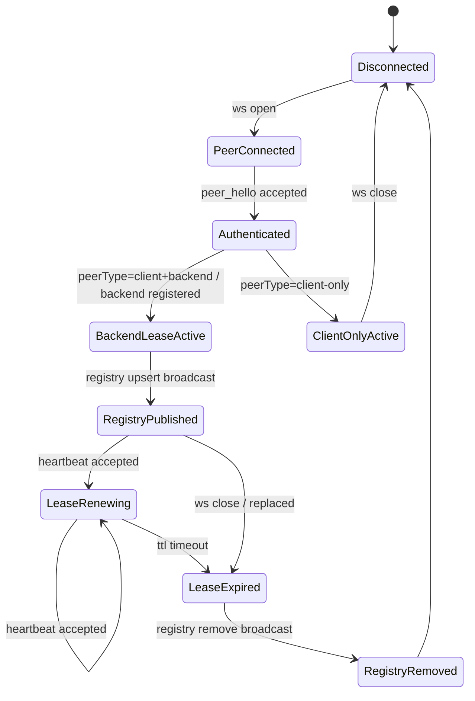
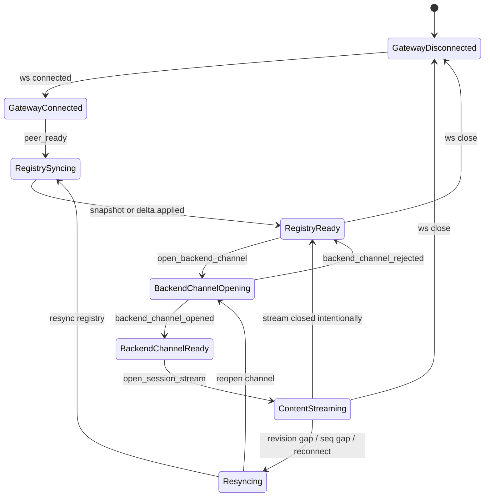
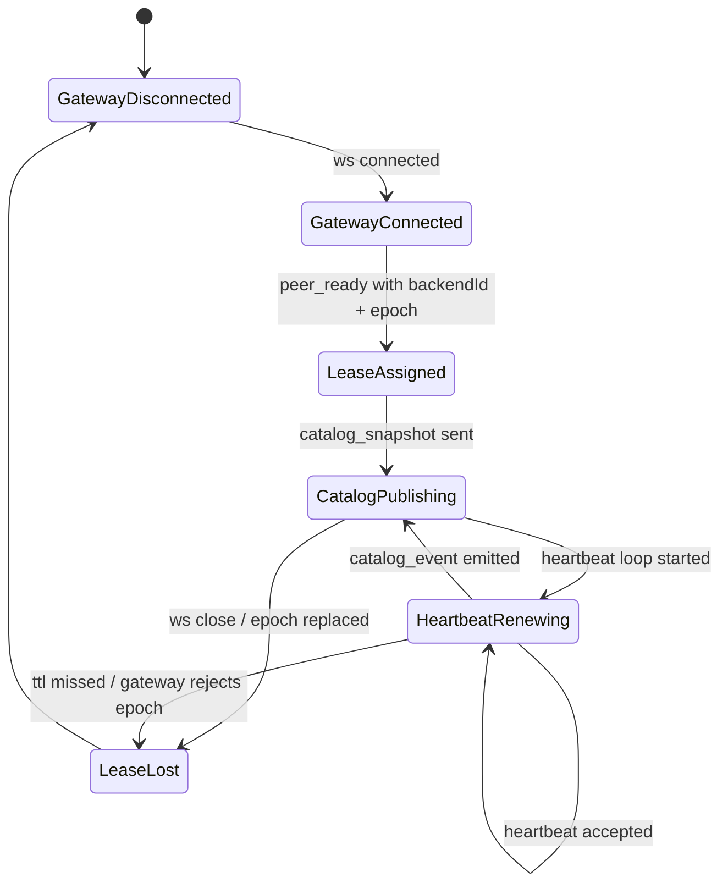
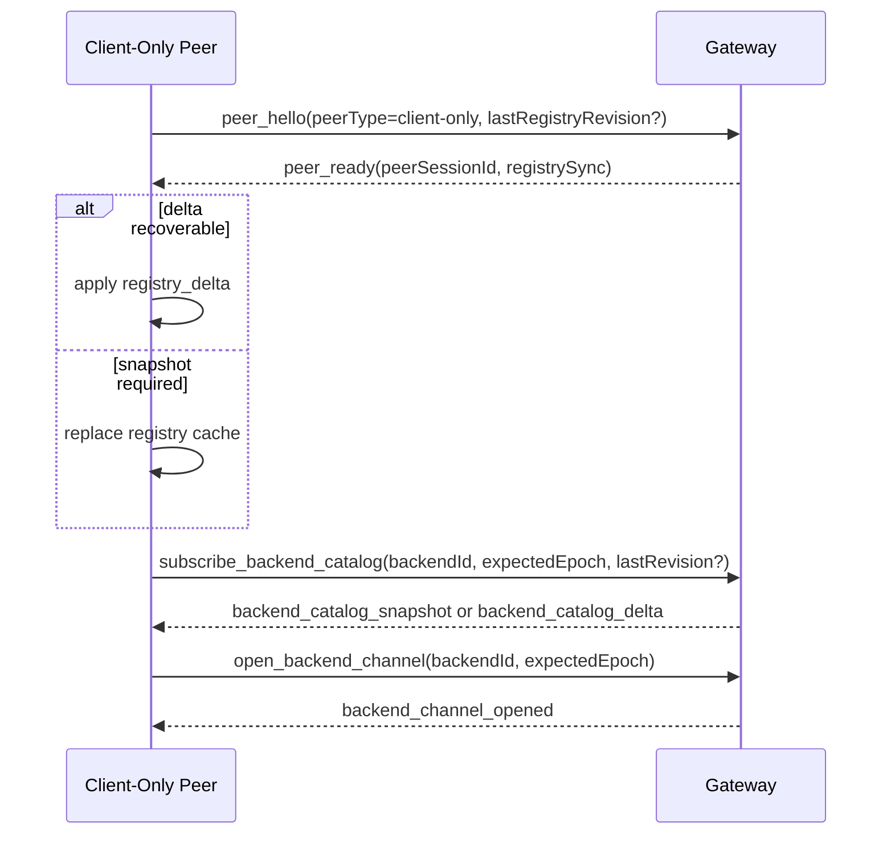
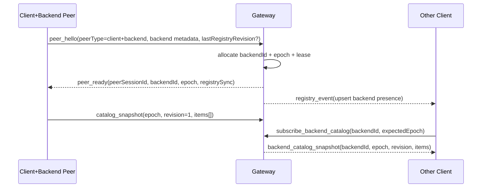
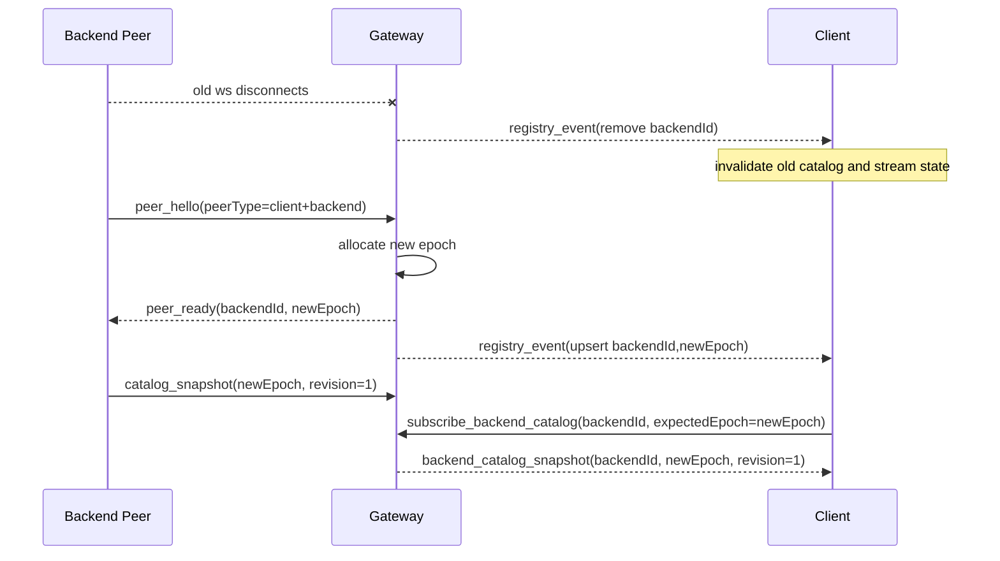
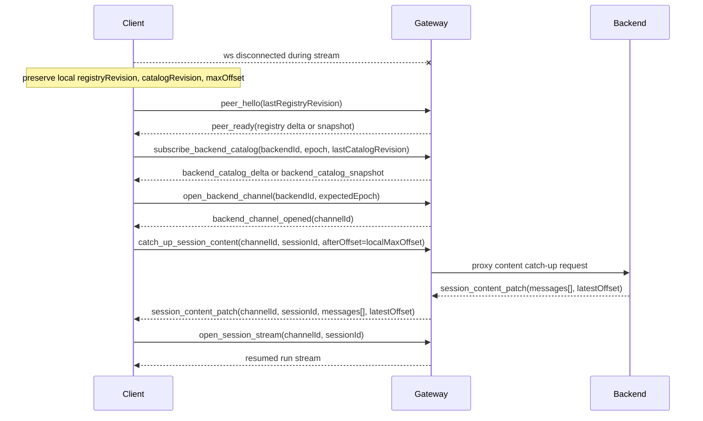
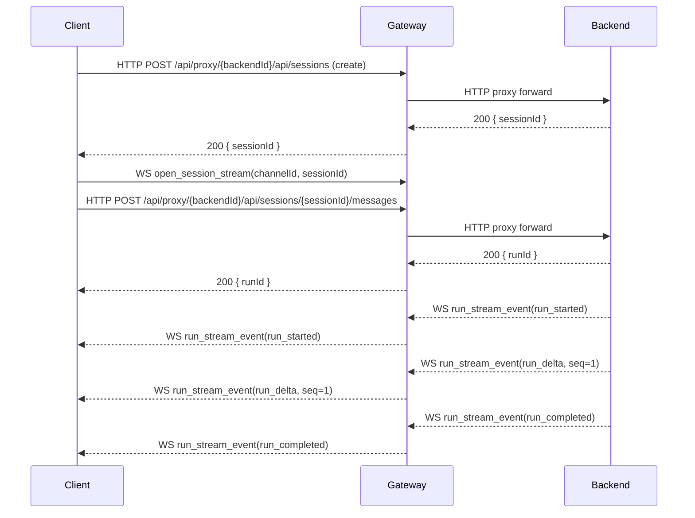
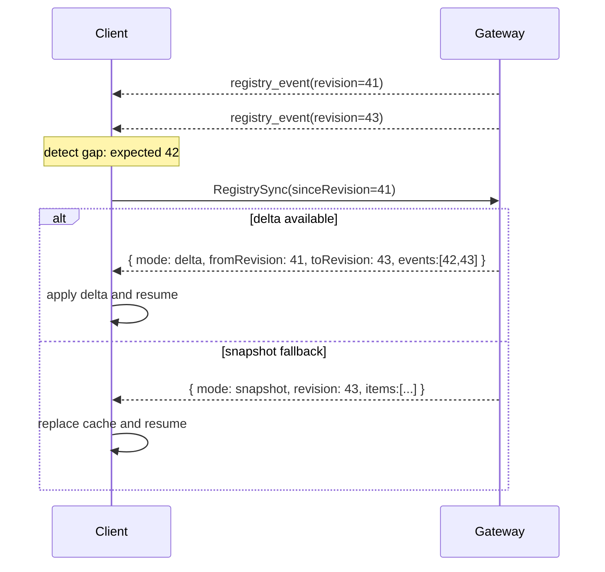

# Gateway Sync Protocol v2

## Status

- Status: Draft
- Owners: MyClaudia
- Scope: Gateway, client-only peer, client+backend peer
- Goal: 建立一套单一真相源、可恢复、可演进的 client/backend/gateway 同步协议

---

## 1. Background

当前 `my-claudia` 的 gateway 相关同步语义混杂了多个层次：

- backend presence 与 session catalog 混在一起
- push、poll、proxy、local cache 彼此交叉
- embedded server 模式和纯 UI 模式职责边界不够清晰
- client 侧容易同时消费多份“backend 列表真相”

这份设计不试图修补当前实现，而是直接定义一套正确的目标协议模型。

---

## 2. Goals

### 2.1 Primary Goals

- `Gateway` 成为 backend presence 的唯一真相源
- `Client` 只与 `Gateway` 同步 backend 状态
- 所有同步都具备明确的恢复语义：增量恢复失败则回退全量快照
- 所有 backend 路由都绑定当前连接世代，避免旧连接消息污染新连接
- 把同步分层为 registry、catalog、content，分别定义契约
- 统一 embedded server 模式与纯 UI 模式的协议语义

### 2.2 Secondary Goals

- 让 push 与 poll 共用同一套 `snapshot / delta / revision` 语义
- 让断线重连、后台切前台、网络抖动都有明确恢复路径
- 为后续权限、远程控制、会话恢复和内容代理打下稳定协议边界

### 2.3 Non-Goals

- 不要求 gateway 在 v2 第一阶段持久化全部聊天内容
- 不要求一次性替换全部旧消息类型
- 不在 v2 第一阶段定义开放的跨产品标准
- 不在本文中约束 UI 展示细节

---

## 3. Design Principles

### 3.1 Gateway Is The Only Presence Authority

backend 是否在线、当前可否路由、epoch 是多少，只能由 gateway 判断。

### 3.2 One Truth Source Per Layer

- registry 真相源：gateway
- catalog 真相源：backend
- content 真相源：backend

client 只通过 gateway 消费这些真相。

### 3.3 Recovery Must Use Stable Cursors

任何恢复流程必须回到稳定游标：

- registry 用 `revision`
- catalog 用 `revision`
- content 用 `offset`

实时流事件不作为断线恢复真相源。

### 3.4 Epoch-Bound Routing

所有业务路由必须绑定 `backendId + epoch`。  
旧 epoch 的消息、订阅、流事件一律丢弃。

### 3.5 Push Is Primary, Poll Is Recovery

主路径是 push。  
poll 只是恢复机制，不是第二条业务同步链路。

### 3.6 Embedded Server Owns Gateway Peer Role

- 有 embedded server 时：embedded server 是唯一 gateway peer，且具备 `client+backend` 双能力
- 无 embedded server 时：UI 才直接作为 `client-only` peer

---

## 4. Node Model

系统只定义三类节点：

### 4.1 Gateway

负责：

- peer 连接管理
- backend registry
- backend lease / heartbeat
- client 订阅与业务路由
- 同步事件窗口与恢复

### 4.2 Peer(client-only)

代表纯 UI 应用，例如：

- 移动端 pure UI mode
- Windows pure UI mode

能力：

- 浏览 registry
- 订阅 backend catalog
- 连接 backend channel
- 拉取 session content

### 4.3 Peer(client+backend)

代表带 embedded server 的应用。

能力：

- 作为 client 消费其他 backend
- 作为 backend 暴露自己
- 向 gateway 上报 catalog 和内容流

---

## 5. Core Concepts

```ts
type ProtocolVersion = number;
type PeerSessionId = string;
type RecoveryToken = string;
type BackendId = string;
type Epoch = number;
type RegistryRevision = number;
type CatalogRevision = number;
type ChannelId = string;
type Offset = number;
type Seq = number;
```

### 5.1 ProtocolVersion

协议版本号，用于握手时协商兼容性。当前版本为 `2`。
gateway 和 peer 必须在 hello/ready 中交换版本号，版本不兼容时 gateway 应拒绝连接。

### 5.2 PeerSession

一条到 gateway 的逻辑连接。
断开后失效，不可复用其路由语义。

### 5.3 RecoveryToken

由 gateway 在 `peer_ready` 时签发的短期恢复令牌。

用途：

- 用于 HTTP poll 或等价恢复 RPC 的认证
- 不等同于 `PeerSessionId`
- 生命周期短于或等于 gateway 的恢复窗口（即 registry/catalog event log 的保留时长，超出后增量恢复不可用，需全量 snapshot）
- peer 成功恢复后可由 gateway 轮换

### 5.4 BackendIdentity

对外公开的稳定 backend 身份，由 `BackendId` 表示。

### 5.5 BackendLease

backend 当前在线租约，由 gateway 维护。
一个 lease 对应一个 `epoch`。

### 5.6 Epoch

backend 每次（重新）注册时由 gateway 分配的单调递增整数。
gateway 必须持久化当前最大 epoch 值，确保重启后不会分配重复 epoch。
不使用时间戳，避免时钟漂移导致的冲突。

### 5.7 RegistryRevision

gateway 全局 backend registry 的单调递增版本号。

### 5.8 CatalogRevision

某个 backend session catalog 的单调递增版本号。

### 5.9 ChannelId

client 与 backend 之间的逻辑通道标识，由 gateway 在 `backend_channel_opened` 时分配。
所有通过 channel 进行的业务操作（content 读取、写入、流订阅）都必须携带 `channelId`。

### 5.10 Offset

某个 session 消息历史中的稳定偏移，用于补洞与分页。

### 5.11 Seq

某个 run 的实时流事件序号，用于去重与乱序检测。

---

## 6. Global Invariants

1. backend presence 只能来自 gateway registry
2. client 不直接请求 backend presence 或 session catalog
3. 所有增量同步都必须可检测 gap
4. 所有业务消息都必须绑定 `backendId + epoch`（通过显式字段或通过 `channelId` 由 gateway 推导）
5. 所有旧 epoch 消息必须被拒绝或丢弃
6. 任何流式恢复都必须回到稳定游标而不是依赖流重放

---

## 7. Layered Sync Model

### 7.1 Layer 1: Registry

内容：

- backend 是否在线
- backend 的公开元数据
- backend 当前 epoch
- backend capabilities

真相源：gateway

### 7.2 Layer 2: Catalog

内容：

- 某个 backend 的 session 列表
- session 轻量元数据

真相源：backend  
消费路径：backend -> gateway -> client

### 7.3 Layer 3: Content

内容：

- session 历史消息
- run 实时流

真相源：backend  
消费路径：client -> gateway -> backend

---

## 8. Transport Model

传输层：

- 长连接控制面：WebSocket
- 恢复面：HTTP poll
- request-response 操作（读写 session、文件传输等）：HTTP Proxy

要求：

- push 与 poll 必须复用同一套消息语义
- peer 成功连接后必须先完成 hello / ready 握手

### 8.1 认证模型

- peer 连接时通过 `peer_hello` 中的 `gatewaySecret` 完成认证（与 v1 一致）
- 所有 peer 使用同一个共享密钥，不在凭证层区分角色
- gateway 认证成功后返回 `peerSessionId` 和 `recoveryToken`
- `peerSessionId` 生命周期与 WebSocket 连接绑定
- `recoveryToken` 用于断线期间的 HTTP poll 恢复，失效时 gateway 必须返回 `401 Unauthorized`
- peer 成功恢复后，gateway 应轮换新的 `recoveryToken`
- HTTP Proxy 沿用现有认证机制（`Authorization: Bearer <gatewaySecret>`）

### 8.2 Peer 身份与权限

- peer 通过 `peerType` 声明自己的角色（`client-only` 或 `client+backend`）
- gateway 根据 `peerType` 决定允许的操作集合

---

## 9. Peer Handshake Protocol

### 9.1 PeerHello

```ts
interface PeerHelloMessage {
  type: 'peer_hello';
  protocolVersion: ProtocolVersion;
  peerType: 'client-only' | 'client+backend';
  gatewaySecret: string;
  identity: {
    deviceId: string;
    instanceId: string;
    channel?: string;
    name?: string;
  };
  backend?: {
    visible: boolean;
    capabilities: string[];
  };
  lastRegistryRevision?: RegistryRevision;
}
```

说明：

- `protocolVersion` 用于版本协商，当前固定为 `2`
- `gatewaySecret` 沿用 v1 的共享密钥认证

### 9.2 PeerReady

```ts
interface PeerReadyMessage {
  type: 'peer_ready';
  protocolVersion: ProtocolVersion;
  peerSessionId: PeerSessionId;
  recoveryToken: RecoveryToken;
  backend?: {
    backendId: BackendId;
    epoch: Epoch;
    leaseTtlMs: number;
  };
  registrySync:
    | {
        mode: 'snapshot';
        revision: RegistryRevision;
        items: BackendPresence[];
      }
    | {
        mode: 'delta';
        fromRevision: RegistryRevision;
        toRevision: RegistryRevision;
        events: RegistryEvent[];
      };
}
```

语义：

- `client-only` peer 不返回 `backend`
- `client+backend` peer 成功注册 backend 后必须返回新的 `epoch`
- gateway 在 hello 成功后立即返回 registry 初始状态，peer 自动订阅 registry 事件推送
- `peer_ready` 中的 `registrySync` 即为初始订阅结果，后续 registry 变化通过 `registry_event` 推送
- 因此逻辑操作 `RegistrySync` 仅用于显式重新同步（如检测到 revision gap 后），而非初始订阅

---

## 10. Registry Protocol

### 10.1 Data Model

```ts
interface BackendPresence {
  backendId: BackendId;
  instanceId: string;
  deviceId: string;
  name: string;
  channel: string;
  visible: boolean;
  capabilities: string[];
  epoch: Epoch;
  connectedAt: number;
  lastSeenAt: number;
}

type RegistryEvent =
  | {
      revision: RegistryRevision;
      op: 'upsert';
      item: BackendPresence;
    }
  | {
      revision: RegistryRevision;
      op: 'remove';
      backendId: BackendId;
    };
```

说明：

- registry 中存在即表示当前在线且可路由
- v2 不建议对 client 暴露长期离线项

### 10.2 Push Messages

```ts
// 文档级映射：RegistrySync 逻辑操作的两种 transport 绑定
// 实际实现中 WS 消息与 HTTP 请求是不同的 runtime type，此处仅描述等价关系
type RegistrySyncRequest =
  | {
      transport: 'ws';
      type: 'resync_registry';
      lastRevision?: RegistryRevision;
    }
  | {
      transport: 'http';
      method: 'GET';
      path: '/sync/registry';
      sinceRevision?: RegistryRevision;
    };

interface RegistrySnapshotMessage {
  type: 'registry_snapshot';
  revision: RegistryRevision;
  items: BackendPresence[];
}

interface RegistryDeltaMessage {
  type: 'registry_delta';
  fromRevision: RegistryRevision;
  toRevision: RegistryRevision;
  events: RegistryEvent[];
}

interface RegistryEventMessage {
  type: 'registry_event';
  event: RegistryEvent;
}
```

说明：

- registry 订阅随 peer session 生命周期自动管理，连接断开即取消，无需显式 unsubscribe
- `resync_registry` 与 `GET /sync/registry` 是同一个逻辑操作 `RegistrySync` 的两种 transport 绑定
- 两者返回语义必须完全一致

### 10.3 Poll Recovery

```http
GET /sync/registry?sinceRevision=<n>
Authorization: Bearer <recoveryToken>
```

返回：

```ts
type RegistrySyncResponse =
  | {
      mode: 'snapshot';
      revision: RegistryRevision;
      items: BackendPresence[];
    }
  | {
      mode: 'delta';
      fromRevision: RegistryRevision;
      toRevision: RegistryRevision;
      events: RegistryEvent[];
    };
```

### 10.4 Client Apply Rules

- `snapshot`：全量替换本地 registry
- `delta`：要求 `fromRevision === localRevision`
- `event`：要求 `event.revision === localRevision + 1`
- 若不满足，则发起逻辑操作 `RegistrySync`

---

## 11. Backend Lease and Heartbeat

### 11.1 Heartbeat

```ts
interface BackendHeartbeatMessage {
  type: 'backend_heartbeat';
  epoch: Epoch;
  observedAt: number;
}

interface HeartbeatAckMessage {
  type: 'heartbeat_ack';
  epoch: Epoch;
  streamDemand: boolean;
}
```

说明：

- `backendId` 不由 backend 自行填充，gateway 根据当前 peer session 查找关联的 backendId
- 这避免了 backend 伪造其他 backendId 的风险
- gateway 校验 `epoch` 是否匹配当前 peer session 的 epoch
- `heartbeat_ack` 由 gateway 回复，`streamDemand` 用于周期性校准 stream 流控状态（见 §14.2）

### 11.2 Gateway Responsibilities

- 为每个 backend 分配 lease
- 维护 `leaseTtlMs`
- 在 lease 超时后移除 registry entry
- 在 backend 重连后分配新的 epoch

### 11.3 Required Behavior

- backend 必须周期性发送 heartbeat
- gateway 必须仅接受当前 epoch 的 heartbeat
- backend 上线、下线、改名、能力变化、可见性变化，都会触发 `RegistryRevision++`

---

## 12. Backend Catalog Protocol

### 12.1 Catalog Item

```ts
interface SessionCatalogItem {
  sessionId: string;
  title?: string;
  createdAt: number;
  updatedAt: number;
  lastMessageAt?: number;
  lastMessagePreview?: string;
  activeRunStatus?: 'idle' | 'running';
  archived?: boolean;
}
```

catalog 只包含轻量元数据，不承载完整消息内容。

### 12.2 Backend -> Gateway

```ts
interface CatalogSnapshotMessage {
  type: 'catalog_snapshot';
  epoch: Epoch;
  revision: CatalogRevision;
  items: SessionCatalogItem[];
}

type CatalogEventMessage =
  | {
      type: 'catalog_event';
      epoch: Epoch;
      revision: CatalogRevision;
      op: 'upsert';
      item: SessionCatalogItem;
    }
  | {
      type: 'catalog_event';
      epoch: Epoch;
      revision: CatalogRevision;
      op: 'remove';
      sessionId: string;
    };
```

gateway 规则：

- 只接受当前 epoch 的 catalog 消息
- backend 重连到新 epoch 后，旧 epoch catalog 状态必须失效
- gateway 必须从当前 peer session 绑定的 backend lease 推导 `backendId`
- backend 不允许在 catalog 上报中自行声明 `backendId`

### 12.3 Client -> Gateway

```ts
interface SubscribeBackendCatalogMessage {
  type: 'subscribe_backend_catalog';
  backendId: BackendId;
  expectedEpoch: Epoch;
  lastRevision?: CatalogRevision;
}

interface UnsubscribeBackendCatalogMessage {
  type: 'unsubscribe_backend_catalog';
  backendId: BackendId;
  expectedEpoch: Epoch;
}
```

说明：

- client 切换到其他 backend 或不再关注某 backend 时，应发送 `unsubscribe_backend_catalog` 释放 gateway 订阅资源
- `unsubscribe_backend_catalog` 必须携带 `expectedEpoch`，避免旧 epoch 的延迟取消请求误伤新 epoch 的订阅
- peer session 断开时，gateway 自动清理该 peer 的所有 catalog 订阅

### 12.4 Gateway -> Client

```ts
interface BackendCatalogSnapshotMessage {
  type: 'backend_catalog_snapshot';
  backendId: BackendId;
  epoch: Epoch;
  revision: CatalogRevision;
  items: SessionCatalogItem[];
}

interface BackendCatalogDeltaMessage {
  type: 'backend_catalog_delta';
  backendId: BackendId;
  epoch: Epoch;
  fromRevision: CatalogRevision;
  toRevision: CatalogRevision;
  events: Array<CatalogDeltaEvent>;
}

type CatalogDeltaEvent =
  | {
      revision: CatalogRevision;
      op: 'upsert';
      item: SessionCatalogItem;
    }
  | {
      revision: CatalogRevision;
      op: 'remove';
      sessionId: string;
    };

type BackendCatalogEventMessage =
  | {
      type: 'backend_catalog_event';
      backendId: BackendId;
      epoch: Epoch;
      revision: CatalogRevision;
      op: 'upsert';
      item: SessionCatalogItem;
    }
  | {
      type: 'backend_catalog_event';
      backendId: BackendId;
      epoch: Epoch;
      revision: CatalogRevision;
      op: 'remove';
      sessionId: string;
    };

interface BackendCatalogResetMessage {
  type: 'backend_catalog_reset';
  backendId: BackendId;
  epoch: Epoch;
}
```

`backend_catalog_reset` 触发条件：

- backend epoch 发生变化（backend 重连分配了新 epoch）
- gateway 检测到 catalog event log 窗口已过期，无法提供增量同步

client 收到 `backend_catalog_reset` 后必须：

1. 丢弃该 backend 的本地 catalog cache
2. 重新发送 `subscribe_backend_catalog`（不带 `lastRevision`）以获取全量 snapshot

client 规则：

- `epoch` 不一致：丢弃本地该 backend catalog cache 并重新订阅
- `revision` 不连续：回退 snapshot

### 12.5 Poll Recovery

```http
GET /sync/backend-catalog/:backendId?epoch=<n>&sinceRevision=<m>
Authorization: Bearer <recoveryToken>
```

返回：

```ts
type BackendCatalogSyncResponse =
  | {
      mode: 'snapshot';
      backendId: BackendId;
      epoch: Epoch;
      revision: CatalogRevision;
      items: SessionCatalogItem[];
    }
  | {
      mode: 'delta';
      backendId: BackendId;
      epoch: Epoch;
      fromRevision: CatalogRevision;
      toRevision: CatalogRevision;
      events: CatalogDeltaEvent[];
    };
```

---

## 13. Backend Channel Protocol

client 想与某个 backend 交互时，必须先打开逻辑通道。channel 是所有业务操作（content 读取、写入、流订阅）的前提。

### 13.1 Open Channel

```ts
interface OpenBackendChannelMessage {
  type: 'open_backend_channel';
  backendId: BackendId;
  expectedEpoch: Epoch;
}

interface BackendChannelOpenedMessage {
  type: 'backend_channel_opened';
  backendId: BackendId;
  epoch: Epoch;
  channelId: ChannelId;
  capabilities: string[];
}

interface BackendChannelRejectedMessage {
  type: 'backend_channel_rejected';
  backendId: BackendId;
  reason: 'offline' | 'epoch_mismatch' | 'max_channels_exceeded';
}
```

gateway 必须校验：

- backend 当前是否存在且在线
- `expectedEpoch === currentEpoch`

说明：

- v2 不需要三方认证（v1 的 `client_auth` / `client_auth_result` 流程）
- 所有持有 `gatewaySecret` 的 peer 均为可信设备，gateway 自行决定 channel 授权
- backend 不感知 channel 的建立和关闭，也不感知 client 身份

### 13.2 Close Channel

```ts
// client 主动关闭
interface CloseBackendChannelMessage {
  type: 'close_backend_channel';
  channelId: ChannelId;
}

// gateway 通知 channel 已关闭（主动关闭确认 或 被动失效通知）
interface BackendChannelClosedMessage {
  type: 'backend_channel_closed';
  channelId: ChannelId;
  backendId: BackendId;
  reason: 'client_closed' | 'backend_offline' | 'epoch_changed' | 'peer_disconnected';
}
```

channel 生命周期规则：

- client 主动关闭：发送 `close_backend_channel`，gateway 回复 `backend_channel_closed(reason=client_closed)`
- backend 断线或 epoch 变化：gateway 主动向所有持有该 backend channel 的 client 推送 `backend_channel_closed`
- peer session 断开：gateway 自动清理该 peer 的所有 channel
- channel 关闭后，所有绑定该 channelId 的 stream 自动终止

### 13.3 并发控制

- 同一个 backend 允许被多个 client 同时打开 channel（多读者）
- gateway 可配置每个 backend 的最大并发 channel 数，超出时拒绝并返回 `max_channels_exceeded`
- 每个 client 同时只能对同一个 backend 持有一个 channel；重复 open 时 gateway 应返回已有的 channelId

---

## 14. Session Content Protocol

WS 协议只负责 **实时流推送和断线补洞**。所有 request-response 式操作走 HTTP Proxy。

| 操作 | 传输方式 | 说明 |
|------|----------|------|
| Run stream（实时推送） | WS | push 模型，channelId 路由 |
| Content catch-up（补洞） | WS | 断线恢复，offset 游标 |
| 历史消息分页读取 | HTTP Proxy | `GET /api/sessions/:id/messages` |
| 创建/删除 session | HTTP Proxy | `POST /api/sessions`, `DELETE /api/sessions/:id` |
| 发送 prompt | HTTP Proxy | `POST /api/sessions/:id/messages` |
| 取消 run | HTTP Proxy | `POST /api/runs/:id/cancel` |
| 文件上传/下载 | HTTP Proxy | 支持大文件 chunked streaming |

HTTP Proxy 路由格式：
- Desktop: `http://127.0.0.1:{localPort}/api/gateway-proxy/{backendId}/...`
- Mobile: `{gatewayUrl}/api/proxy/{backendId}/...`

### 14.1 Common Types

```ts
interface SessionMessage {
  messageId: string;
  sessionId: string;
  offset: Offset;
  role: 'user' | 'assistant' | 'system' | 'tool';
  createdAt: number;
  content: unknown;
}
```

### 14.2 Stream Demand（流控）

gateway 通过 `stream_demand` 控制 backend 是否推送 run stream event，粒度为 **per-backend**（非 per-session）。

```ts
// gateway -> backend
interface StreamDemandMessage {
  type: 'stream_demand';
  active: boolean;
}
```

gateway 维护 per-backend 的 channel 引用计数：

| 事件 | 动作 |
|------|------|
| client `open_backend_channel` 成功 | `channelCount++`，若 0→1 发 `stream_demand { active: true }` |
| client `close_backend_channel` | `channelCount--`，若 1→0 发 `stream_demand { active: false }` |
| client 断线（gateway 清理该 peer 的所有 channel） | 对应 backend `channelCount--`，同上 |
| backend 断线重连（新 epoch） | 重置为 0，等待 client 重新 open channel |

backend 规则：

- 收到 `stream_demand { active: true }` → 开始推 `BackendRunStreamEvent`
- 收到 `stream_demand { active: false }` → 停止推
- 刚连接时默认 `active = false`，等待 gateway 通知
- 以最近一次 `stream_demand` 或 `heartbeat_ack.streamDemand`（见 §11.1）为准

Fallback 校准：

- `heartbeat_ack` 中携带 `streamDemand` 字段，每个 heartbeat 周期自动校准一次
- 这覆盖了 `stream_demand` 消息丢失、gateway 重启等异常场景
- backend 无需额外定时器，搭 heartbeat 的便车即可

`active` 从 false 变 true 时的恢复：

- client 在 `open_session_stream` 后应发 `catch_up_session_content` 补齐 `active=false` 期间缺失的内容
- 之后 stream event 和 catch-up 数据的重叠部分通过 `offset` / `seq` 去重

### 14.3 Real-Time Run Stream

```ts
// client -> gateway
interface OpenSessionStreamMessage {
  type: 'open_session_stream';
  channelId: ChannelId;
  sessionId: string;
}

interface CloseSessionStreamMessage {
  type: 'close_session_stream';
  channelId: ChannelId;
  sessionId: string;
}

// gateway -> client
interface SessionStreamClosedMessage {
  type: 'session_stream_closed';
  channelId: ChannelId;
  sessionId: string;
  reason: 'client_closed' | 'channel_closed' | 'backend_offline' | 'epoch_changed';
}

// backend -> gateway（backend 不感知 channelId）
interface BackendRunStreamEvent {
  type:
    | 'run_started'
    | 'run_delta'
    | 'tool_call_started'
    | 'tool_call_delta'
    | 'tool_call_completed'
    | 'run_completed'
    | 'run_failed';
  sessionId: string;
  runId: string;
  seq: Seq;
  payload: unknown;
}

// gateway -> client（gateway 注入 channelId 后转发）
interface RunStreamEvent {
  type:
    | 'run_started'
    | 'run_delta'
    | 'tool_call_started'
    | 'tool_call_delta'
    | 'tool_call_completed'
    | 'run_completed'
    | 'run_failed';
  channelId: ChannelId;
  sessionId: string;
  runId: string;
  seq: Seq;
  payload: unknown;
}
```

client 规则：

- 每个 `runId` 维护 `maxSeq`
- `seq <= maxSeq`：去重丢弃
- `seq > maxSeq + 1`：判定 gap，进入内容补偿

stream 生命周期：

- client 主动关闭：发送 `close_session_stream`
- channel 被关闭时：所有关联 stream 自动终止，gateway 推送 `session_stream_closed`

gateway 转发规则：

- backend 上报的 run stream event 不携带 `channelId`（backend 不感知 channel 概念）
- gateway 根据 `sessionId` 和订阅关系查找对应的 channel，注入 `channelId` 后转发给 client
- 若同一 session 被多个 client channel 订阅，gateway 向每个 channel 分别转发

### 14.4 Content Catch-Up

```ts
interface CatchUpSessionContentMessage {
  type: 'catch_up_session_content';
  channelId: ChannelId;
  sessionId: string;
  afterOffset: Offset;
}

interface SessionContentPatchMessage {
  type: 'session_content_patch';
  channelId: ChannelId;
  sessionId: string;
  messages: SessionMessage[];
  latestOffset: Offset;
}
```

规则：

- 实时流断线恢复不依赖 event replay
- 恢复必须回到稳定游标 `offset`

### 14.5 Request Correlation and Idempotency

v2 起步阶段继续允许通过 HTTP Proxy 承载写操作，但必须统一请求关联与重试语义。

规范：

- 所有**有副作用**的 HTTP Proxy 请求都必须携带 `X-Request-Id`
- `X-Request-Id` 由 client 生成，重试同一逻辑操作时必须保持不变
- gateway 必须原样转发 `X-Request-Id`
- backend 必须对 `(authenticated principal, requestId)` 做幂等去重
- 幂等记录的最小保留时间建议为 `24h`
- 成功响应应回显 `X-Request-Id`，便于 client 对账

client 规则：

- 超时但结果未知时，必须使用同一个 `X-Request-Id` 重试
- 不允许在结果未知时更换 request id 再次发送同一写操作

v2 起步阶段的适用范围：

- 创建 session
- 发送 prompt
- 取消 run
- 删除 session
- 其他未来新增的有副作用接口

---

## 15. Client State Model

建议 client 本地拆成三份状态：

### 15.1 Registry Cache

```ts
interface ClientRegistryCache {
  revision: RegistryRevision;
  items: Record<BackendId, BackendPresence>;
}
```

### 15.2 Catalog Cache

```ts
interface BackendCatalogCache {
  backendId: BackendId;
  epoch: Epoch;
  revision: CatalogRevision;
  items: Record<string, SessionCatalogItem>;
}
```

### 15.3 Content Cache

```ts
interface SessionContentCache {
  backendId: BackendId;
  epoch: Epoch;
  sessionId: string;
  maxOffset: Offset;
  messages: SessionMessage[];
}
```

要求：

- registry 变化导致 backend 消失时，其 catalog cache 必须失效
- backend epoch 变化时，其 catalog 与 session stream 状态必须失效
- content 使用前必须确认 `backendId + epoch` 仍匹配当前 registry

---

## 16. Gateway State Responsibilities

gateway 至少需要维护：

- peer sessions
- backend registry
- backend lease / heartbeat state
- registry event log window
- per-backend catalog state
- per-backend catalog event log window
- backend channel ownership
- per-backend channel 引用计数（用于 stream demand 流控）

对于 content 层，gateway 只承担：

- 请求转发
- 流转发
- epoch 校验
- 通道管理

不要求 gateway 在 v2 第一阶段持久化全部 session content。

---

## 17. Recovery Rules

### 17.1 Registry Recovery

client 重连后：

1. 使用 `lastRegistryRevision`
2. 尝试 delta 恢复
3. 失败则回退 snapshot

### 17.2 Catalog Recovery

对当前活跃 backend：

1. 使用 `backendId + epoch + lastCatalogRevision`
2. 尝试 delta 恢复
3. 失败则回退 snapshot

### 17.3 Content Recovery

对当前打开 session：

1. 先根据当前 registry 恢复有效的 `backendId + epoch`
2. 重新打开 backend channel，获取新的 `channelId`
3. 使用 `channelId + sessionId + localMaxOffset` 发起 `catch_up_session_content`
4. 用 `offset` 补齐缺失消息

### 17.4 Required Rule

任何实时流断线后的恢复，都必须回到稳定游标：

- registry / catalog 用 revision
- content 用 offset

不得依赖实时流重放作为最终恢复真相。

---

## 18. Error Model

```ts
type GatewayErrorCode =
  | 'INVALID_MESSAGE'
  | 'PROTOCOL_VERSION_MISMATCH'
  | 'UNAUTHORIZED'
  | 'REGISTRY_REVISION_GAP'
  | 'CATALOG_REVISION_GAP'
  | 'BACKEND_OFFLINE'
  | 'BACKEND_EPOCH_MISMATCH'
  | 'BACKEND_CHANNEL_NOT_FOUND'
  | 'BACKEND_CHANNEL_CLOSED'
  | 'MAX_CHANNELS_EXCEEDED'
  | 'SESSION_NOT_FOUND'
  | 'STREAM_GAP_DETECTED'
  | 'RATE_LIMITED';

interface GatewayErrorMessage {
  type: 'gateway_error';
  code: GatewayErrorCode;
  message: string;
  recovery?: 'resync_registry' | 'resync_catalog' | 'reopen_channel' | 'catch_up_content' | 'reconnect';
}
```

错误处理原则：

- 可恢复错误必须通过 `recovery` 字段明确指向 resync 行为
- 不允许静默忽略 epoch mismatch 或 revision gap
- `RATE_LIMITED` 错误应包含 `Retry-After` 语义（在 message 中说明等待时间）
- 写操作相关的错误（如 request timeout、validation error）由 HTTP Proxy 以 HTTP status code 返回，不在此错误模型中

---

## 19. State Machines

### 19.1 Gateway

```text
peer connected
  -> peer authenticated
  -> backend lease active (optional)
  -> backend registry published
  -> backend lease expired / removed
```



说明：`ClientOnlyActive` 是持续连接状态，peer 在此状态下接收 registry event 推送、订阅 catalog、打开 channel 等。连接断开时转入 `Disconnected`。

### 19.2 Client

```text
gateway disconnected
  -> gateway connected
  -> registry synced
  -> backend channel opening
  -> backend channel ready
  -> content streaming
  -> resyncing (on gap / reconnect)
```



### 19.3 Backend

```text
gateway disconnected
  -> gateway connected
  -> lease assigned
  -> heartbeat renewing
  -> catalog publishing
  -> lease lost / reconnect
```



---

## 20. Key Sequences

### 20.1 Client-Only Peer Connect

1. client 发送 `peer_hello(peerType=client-only, lastRegistryRevision?)`
2. gateway 验证并返回 `peer_ready`
3. client 应用 registry snapshot 或 delta
4. client 按需订阅 backend catalog
5. client 按需打开 backend channel



### 20.2 Client+Backend Peer Connect

1. peer 发送 `peer_hello(peerType=client+backend, backend metadata, lastRegistryRevision?)`
2. gateway 分配 `backendId + epoch + leaseTtlMs`
3. gateway 返回 `peer_ready`
4. gateway 发布 registry upsert
5. backend 发送 `catalog_snapshot`
6. 其他已订阅 client 看到该 backend 并可进一步订阅 catalog



### 20.3 Backend Reconnect

1. backend 断线，旧 lease 失效
2. gateway 广播 registry remove
3. backend 重连，gateway 分配新 epoch
4. gateway 广播 registry upsert
5. backend 重发 `catalog_snapshot`
6. client 发现 epoch 变化，丢弃旧 catalog / stream 状态并重建



### 20.4 Content Recovery After Disconnect

1. client 重连 gateway
2. 恢复 registry
3. 恢复 catalog
4. 重新打开 backend channel（获取新 channelId）
5. 对当前 session 发 `catch_up_session_content(afterOffset=localMaxOffset)`
6. 用返回内容补洞
7. 继续实时流



### 20.5 Client Send Prompt (HTTP Proxy + WS Stream)

1. client 通过 HTTP Proxy 创建 session（或使用已有 session）
2. client 通过 WS 打开 session stream（准备接收实时事件）
3. client 通过 HTTP Proxy 发送 prompt
4. backend 开始 run，通过 WS 推送实时流事件
5. client 可通过 HTTP Proxy 取消 run



### 20.6 Registry Gap Recovery

1. client 收到不连续的 registry revision
2. client 停止应用后续 registry event
3. client 发起逻辑操作 `RegistrySync`
4. gateway 返回 delta 或 snapshot
5. client 恢复正常订阅



---

## 21. Embedded Server Deployment Model

### 21.1 With Embedded Server

拓扑：

```text
UI <-> Embedded Server(client+backend peer) <-> Gateway
```

要求：

- embedded server 持有 gateway sync state
- UI 只消费 embedded server 暴露的本地 view model
- UI 不直接维护另一份 gateway registry

### 21.2 Without Embedded Server

拓扑：

```text
UI(client-only peer) <-> Gateway
```

要求：

- UI 自己维护 gateway sync state
- 协议语义与 embedded server 模式保持一致

---

## 22. Migration Strategy

采用一刀切策略：gateway 升级后只接受 v2 协议，所有 client/backend 必须同步升级。不保留 v1 兼容层。

理由：

- 私有部署，端的数量可控
- 避免 gateway 维护两套状态逻辑的复杂度
- 不留兼容债务

实施顺序：

1. 在 `shared/` 定义 v2 协议类型，替换旧类型
2. gateway 实现 v2（registry + catalog + channel + stream），移除 v1 消息处理
3. server（backend 侧）适配 v2 peer_hello + heartbeat + catalog 上报
4. desktop（client 侧）适配 v2 registry/catalog sync + channel + stream
5. 一次性部署所有端

---

## 23. Implementation Decisions For V2 Start

为保证可以直接开工，v2 第一阶段做以下明确取舍：

### 23.1 Event Log Window

- registry event log：只保留内存窗口
- catalog event log：只保留内存窗口
- 默认策略：窗口内可增量恢复，窗口外直接回退 snapshot
- v2 起步阶段不要求持久化 replay log

### 23.2 Catalog Update Shape

- catalog 只支持 `upsert` 全量项和 `remove`
- v2 不引入字段级 patch 语义

### 23.3 Content Recovery

- v2 不实现 session 级 replay buffer
- 内容恢复统一依赖 `catch_up_session_content(afterOffset)`

### 23.4 Channel Authorization

- v2 只定义一种标准 backend channel
- 不区分只读 / 读写 channel
- 权限控制放在 peer 级和 backend 级，不在 channel 级细分

### 23.5 Catalog Size

- v2 第一阶段不做 catalog 分页
- backend 必须限制单次 `catalog_snapshot` 大小在可接受范围
- 若未来 catalog 规模成为问题，再引入 `cursor/limit`

### 23.6 Deployment Topology

- v2 第一阶段只支持单 gateway 实例
- 不在第一阶段解决 gateway 集群下的 epoch / revision 跨节点一致性

### 23.7 HTTP Proxy Surface

- v2 第一阶段继续沿用现有 backend REST API 语义
- gateway 负责统一路由、认证、幂等请求头转发
- 不在第一阶段重新标准化所有 backend HTTP endpoint

---

## 24. Acceptance Criteria

达到以下条件即可进入实现阶段：

1. 同一 backend 断线重连后，client 不会继续接收旧 epoch 的 catalog 或 stream 事件
2. registry gap、catalog gap、content gap 都有明确恢复路径，且不依赖第二真相源
3. embedded server 模式下，UI 不直接维护独立 gateway registry
4. 纯 UI 模式下，UI 可独立完成 registry/catalog/content 恢复
5. 所有有副作用写操作都具备 request correlation 与幂等重试语义
6. push 与 poll 对同一逻辑同步操作返回完全一致的语义结果
7. gateway 重启或短暂断连后，client 能通过 snapshot/delta/catch-up 收敛到正确状态

---

## 25. Deferred Questions

这些问题不会阻塞 v2 第一阶段开工：

- gateway 集群化后的 revision / epoch 分布式一致性
- catalog 分页与超大 backend 的目录分片
- channel 的细粒度权限模型
- 统一标准化 backend HTTP endpoint 规范
- 是否引入持久化 replay log 提升长断线恢复效率

---

## 26. Recommended Next Steps

1. 在 `shared/` 定义 v2 协议类型（含 discriminated union、RecoveryToken、ChannelId）
2. 明确 gateway 内部状态表结构（含 epoch 持久化、event log window、channel ownership）
3. 实现 gateway v2，直接替换 v1
4. 适配 server（backend）和 desktop（client）
5. 为 registry/catalog/content recovery 各补一组端到端测试
